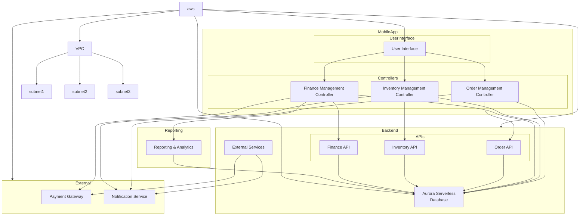

# langchain-examples

<h4 align="center">
  
  
  
  
  
</h4>

This repository contains a collection of apps powered by LangChain.

[LangChain](https://langchain.readthedocs.io/en/latest) is an open-source framework created to aid the development of applications leveraging the power of large language models (LLMs). It can be used for chatbots, text summarisation, data generation, code understanding, question answering, evaluation, and more.

### [all-in-one](https://github.com/thirunavukkarasu/langchain-examples/blob/main/all-in-one)

A multi-page Streamlit application showcasing generative AI uses cases with LangChain, OpenAI, and others.

### [chroma-summary](https://github.com/thirunavukkarasu/langchain-examples/blob/main/chroma-summary)

A sample Streamlit web application for summarizing documents using LangChain and Chroma.

### [helicone](https://github.com/thirunavukkarasu/langchain-examples/blob/main/helicone)

A sample Streamlit web application to demo LLM observability using LangChain and Helicone.

### [news-summary](https://github.com/thirunavukkarasu/langchain-examples/blob/main/news-summary)

A sample Streamlit application for Google news search and summaries using LangChain and Serper API.

### [pinecone-qa](https://github.com/thirunavukkarasu/langchain-examples/blob/main/pinecone-qa)

A sample Streamlit web application for generative question-answering with LangChain and Pinecone.

### [pinecone-summary](https://github.com/thirunavukkarasu/langchain-examples/blob/main/pinecone-summary)

A sample Streamlit web application for document summarization with LangChain and Pinecone.

### [search](https://github.com/thirunavukkarasu/langchain-examples/blob/main/search)

A sample Streamlit web application for search queries using LangChain and SerpApi.

### [text-summary](https://github.com/thirunavukkarasu/langchain-examples/blob/main/text-summary)

A sample Streamlit web application for summarizing text using LangChain and OpenAI.

### [url-summary](https://github.com/thirunavukkarasu/langchain-examples/blob/main/url-summary)

A sample Streamlit application to summarize URL content using LangChain and OpenAI.

